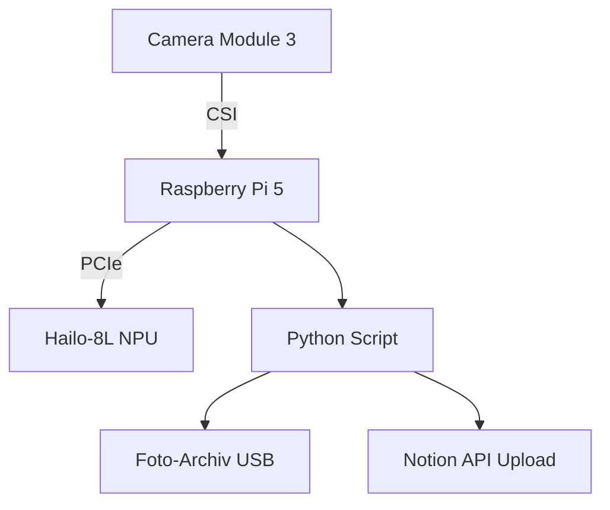

# Projekt-Bauplan: [Projekt-Name]

> **Template-Version:** 1.0  
> **Datum:** [Datum]  
> **Ersteller:** [Name]  
> **Difficulty Level:** [1-4] (1=Anfänger, 2=Fortgeschritten, 3=Experte, 4=NPU/Kernel)

---

## 1. Projektziel

### Was wird gebaut?
[Kurze Beschreibung des Projekts in 2-3 Sätzen]

### Warum?
[Use Case, Problem das gelöst wird, Lernziele]

### Erwartetes Ergebnis
[Was kann das System am Ende? Messbare Ziele]

**Beispiel:**
```
Was: KI-gestützte Vogel-Erkennungskamera für den Garten
Warum: Automatische Dokumentation der Vogelarten für Citizen Science
Ergebnis: System erkennt 50 häufige CH-Vogelarten mit >90% Genauigkeit, 
         speichert Fotos mit Zeitstempel und Art-Label
```

---

## 2. Hardware-Anforderungen

### Mindestanforderungen

| Komponente | Spezifikation | Begründung |
|------------|---------------|------------|
| **Raspberry Pi** | [Modell, RAM] | [Warum dieses Modell?] |
| **Stromversorgung** | [Leistung, Typ] | [Strombudget-Rechnung] |
| **Speicher** | [Grösse, Typ] | [Speicherbedarf] |
| **Kühlung** | [Passiv/Aktiv] | [Thermal-Anforderungen] |

### Zusätzliche Hardware

| Komponente | Anzahl | Zweck | Schnittstelle |
|------------|--------|-------|---------------|
| [z.B. Camera Module 3] | 1 | Bildaufnahme | CSI |
| [z.B. BME280 Sensor] | 1 | Temperatur/Luftfeuchtigkeit | I2C |
| ... | ... | ... | ... |

---

## 3. Architektur-Diagramm

```
[ASCII-Diagramm oder Mermaid-Graph der System-Architektur]

Beispiel (ASCII):
┌─────────────┐
│  Camera     │
│  Module 3   │──┐
└─────────────┘  │
                 │ CSI
                 ▼
┌─────────────────────────────┐
│   Raspberry Pi 5            │
│   ┌─────────────────────┐   │
│   │  Hailo-8L NPU       │   │
│   │  (Objekt-Erkennung) │   │
│   └─────────────────────┘   │
│   ┌─────────────────────┐   │
│   │  Python Script      │   │
│   │  (Klassifikation)   │   │
│   └─────────────────────┘   │
└─────────────────────────────┘
                 │
                 │ USB
                 ▼
┌─────────────────────────────┐
│  USB-Speicher               │
│  (Foto-Archiv)              │
└─────────────────────────────┘
```

Oder mit Mermaid:


---

## 4. Komponentenliste (BOM)

| # | Komponente | Spezifikation | Menge | Preis/Stk | Total | Bezugsquelle | Notizen |
|---|------------|---------------|-------|-----------|-------|--------------|---------|
| 1 | Raspberry Pi 5 | 8 GB RAM | 1 | 120 CHF | 120 CHF | [pi-shop.ch](https://pi-shop.ch) | - |
| 2 | AI Kit (Hailo-8L) | 26 TOPS | 1 | 70 CHF | 70 CHF | [pi-shop.ch](https://pi-shop.ch) | Nur Pi 5 |
| 3 | Camera Module 3 | 12 MP, Autofokus | 1 | 40 CHF | 40 CHF | [pi-shop.ch](https://pi-shop.ch) | Mini-CSI |
| 4 | Active Cooler | PWM, Official | 1 | 8 CHF | 8 CHF | [pi-shop.ch](https://pi-shop.ch) | Obligatorisch |
| 5 | USB-C PD PSU | 27W, 5.1V/5A | 1 | 15 CHF | 15 CHF | [pi-shop.ch](https://pi-shop.ch) | - |
| 6 | SD-Karte | SanDisk 64GB A2 | 1 | 15 CHF | 15 CHF | [digitec.ch](https://digitec.ch) | - |
| ... | ... | ... | ... | ... | ... | ... | ... |
| **TOTAL** | | | | | **268 CHF** | | |

**Optionale Komponenten:**
- [z.B. Wetterschutz-Gehäuse: 30 CHF]
- [z.B. USB-Speicher 128GB: 25 CHF]

---

## 5. Schaltplan / Verkabelung

### GPIO-Pin-Zuordnung

| GPIO | Funktion | Komponente | Spannung | Notizen |
|------|----------|------------|----------|---------|
| GPIO 2 | SDA (I2C) | BME280 | 3.3V | Pull-Up aktiv |
| GPIO 3 | SCL (I2C) | BME280 | 3.3V | Pull-Up aktiv |
| GPIO 17 | Output | LED (Status) | 3.3V | 220Ω Vorwiderstand |
| ... | ... | ... | ... | ... |

### Verkabelungs-Diagramm

```
Raspberry Pi 5 (40-Pin Header)
================================
Pin 1  (3.3V)  ──────┬───── BME280 (VCC)
                     │
Pin 3  (GPIO 2) ─────┼───── BME280 (SDA)
                     │
Pin 5  (GPIO 3) ─────┼───── BME280 (SCL)
                     │
Pin 6  (GND)    ─────┴───── BME280 (GND)

Pin 11 (GPIO 17) ───[220Ω]─── LED (+) ───[GND]
```

### Spannungs- und Strom-Validierung

| Komponente | Spannung | Max. Strom | Quelle | Validierung |
|------------|----------|------------|--------|-------------|
| BME280 | 3.3V | 0.3 mA | GPIO Pin 1 | ✅ <500mA Limit |
| LED + Widerstand | 3.3V | 15 mA | GPIO 17 | ✅ <16mA Limit |
| Hailo-8L | 12V (PCIe) | 6W | PCIe Bus | ✅ PSU 27W |
| **TOTAL** | | ~6.3W | | ✅ <21.6W (80% von 27W) |

---

## 6. Mechanik & Aufbau

> Referenz: `mechanical.md` (Masse aus RP-008347-DS-1 und RP-006237-DD-1).
> Alle Herstellermasse sind Referenzwerte mit Toleranz – für passgenaue Teile nachmessen.

### Platzbedarf

| Grösse | Wert | Im Projekt |
|--------|------|------------|
| Platine Pi 5 | 85 × 56 mm | – |
| Realer Fussabdruck (Buchsen ragen 3 mm über) | **88 × 56 mm** | [Gehäuse-Innenmass] |
| Mit offiziellem Bumper | **89,6 × 60,6 mm** | [ja/nein] |
| Bohrbild | 58 × 49 mm, Ø 2,7 mm (M2.5) | [Standoff-Typ] |
| Bauhöhe des Stapels | Platine + HAT + Cooler | [gemessen: __ mm] |

### Gehäuse & Montage

| Punkt | Entscheidung | Begründung |
|-------|--------------|------------|
| Gehäusetyp | [offen / Bumper / Alu / 3D-Druck] | [Thermik, Schutz, Optik] |
| Montageart | [Standoffs / DIN-Schiene / VESA / frei] | |
| Standoff-Material | [Nylon / Messing + Isolierscheibe] | Leiterbahnen um die Bohrungen |
| Belüftung | [Öffnungen, Luftweg] | Gehäuse darf nie abgedeckt sein |
| Kabelmanagement | [Zugentlastung USB-C, FFC-Biegeradius ≥ 10 mm] | |

### Ausschnitte (Mittenmasse)

| Anschluss | Position | Ausschnitt geplant |
|-----------|----------|--------------------|
| USB-C (Power) | 11,2 mm ab linker Kante | [ ] |
| Micro-HDMI 0 | 25,8 mm ab linker Kante | [ ] |
| Micro-HDMI 1 | 39,2 mm ab linker Kante | [ ] |
| Ethernet | 10,2 mm ab Unterkante (rechte Kante) | [ ] |
| USB 3.0 (unten) | 29,1 mm ab Unterkante | [ ] |
| USB 3.0 (oben) | 47 mm ab Unterkante | [ ] |

Ausschnitthöhe an der Anschlusskante ≥ 4,4 mm über der Platinenoberseite.
Toleranzzugabe: +0,5 mm (Spritzguss) bzw. +0,8–1,0 mm (FDM-Druck) pro Seite.

### Umgebungsbedingungen

| Parameter | Anforderung | Projektwert |
|-----------|-------------|-------------|
| Umgebungstemperatur (Spezifikation) | 0 °C bis 70 °C | [erwarteter Bereich] |
| Aufstellung | stabil, eben, nicht leitfähig | [ ] |
| Feuchtigkeit / Kondensation | keine | [Massnahme] |
| Erwartete Innentemperatur im Gehäuse | < 70 °C | [gemessen: __ °C] |

⚠️ Bei Aussenaufstellung oder Schaltschrank: Umgebungsgrenze zuerst prüfen – sie wird
verletzt, bevor `vcgencmd measure_temp` auffällig wird.

---

## 7. Software-Stack

### Betriebssystem

| Software | Version | Download | Notizen |
|----------|---------|----------|---------|
| Raspberry Pi OS | 64-bit Bookworm | [raspberrypi.com](https://www.raspberrypi.com/software/) | Lite oder Desktop |
| Kernel | 6.6+ | (included) | Für Pi 5 obligatorisch |

### System-Konfiguration

**Aktivierungen in `/boot/firmware/config.txt`:**
```bash
# Hailo-8L (PCIe Gen 3)
dtparam=pciex1_gen=3

# Kamera
camera_auto_detect=1

# GPU Memory (reduzieren für mehr RAM)
gpu_mem=128

# Active Cooler
dtparam=fan_temp0=65000      # Start-Temperatur 65°C
dtparam=fan_temp0_hyst=5000  # Hysterese 5°C
```

### Python-Umgebung

```bash
# Virtual Environment erstellen (PEP 668!)
python3 -m venv .venv --system-site-packages
source .venv/bin/activate

# Basis-Libraries
pip install --upgrade pip
pip install numpy opencv-python pillow
```

### Projekt-spezifische Dependencies

| Library | Version | Zweck | Installation |
|---------|---------|-------|--------------|
| `hailort` | latest | Hailo NPU Treiber | `pip install hailort` |
| `picamera2` | latest | Kamera-Interface | `pip install picamera2` |
| `smbus2` | latest | I2C-Kommunikation | `pip install smbus2` |
| ... | ... | ... | ... |

---

## 8. Implementierungsschritte

### Phase 1: OS-Grundkonfiguration (Difficulty 1)

**Ziel:** Stabiles Betriebssystem mit aktivierter Hardware

**Schritte:**
1. **SD-Karte flashen:**
   ```bash
   # Raspberry Pi Imager verwenden
   # OS: Raspberry Pi OS (64-bit) Bookworm
   # Settings: Hostname, User, WiFi, SSH konfigurieren
   ```

2. **Erste Konfiguration:**
   ```bash
   ssh pi@raspberrypi.local
   
   # System aktualisieren
   sudo apt update && sudo apt upgrade -y
   
   # Zeitzonen setzen
   sudo timedatectl set-timezone Europe/Zurich
   ```

3. **Hardware aktivieren (config.txt):**
   ```bash
   sudo nano /boot/firmware/config.txt
   # [Änderungen einfügen siehe Abschnitt 7]
   sudo reboot
   ```

4. **Validierung:**
   ```bash
   # Kamera sichtbar?
   rpicam-hello --list-cameras
   
   # Hailo sichtbar?
   lspci | grep -i hailo
   
   # I2C aktiv?
   i2cdetect -y 1
   ```

**✅ Exit Criteria:**
- Alle Hardware-Interfaces erkannt
- Keine Undervoltage-Warnungen
- Temperatur <80°C

---

### Phase 2: Hardware-Tests (Difficulty 2)

**Ziel:** Jede Komponente einzeln funktionsfähig

#### 2.1 Kamera-Test

```bash
# Foto aufnehmen
rpicam-still -o test.jpg --width 1920 --height 1080

# Stream (5 Sekunden)
rpicam-hello -t 5000
```

**✅ Exit Criteria:** Foto ist scharf, korrekt belichtet

#### 2.2 Sensor-Test (BME280)

```python
from smbus2 import SMBus
from bme280 import BME280

bus = SMBus(1)
bme280 = BME280(i2c_dev=bus)

print(f"Temperatur: {bme280.get_temperature():.1f}°C")
print(f"Luftfeuchtigkeit: {bme280.get_humidity():.1f}%")
print(f"Luftdruck: {bme280.get_pressure():.1f} hPa")
```

**✅ Exit Criteria:** Sensorwerte plausibel

#### 2.3 Hailo-Test

```bash
# NPU identifizieren
hailortcli fw-control identify

# Benchmark
hailortcli benchmark --hef yolov8s.hef
```

**✅ Exit Criteria:** NPU erkannt, Benchmark >40 FPS

---

### Phase 3: Software-Layer 1 – Basis-Libraries (Difficulty 2)

**Ziel:** Alle Dependencies installiert und importierbar

```bash
# Virtual Environment
python3 -m venv .venv --system-site-packages
source .venv/bin/activate

# Dependencies installieren
pip install hailort picamera2 smbus2 bme280 numpy opencv-python

# Test
python3 -c "import hailort, picamera2, smbus2, cv2; print('OK')"
```

**✅ Exit Criteria:** Alle imports erfolgreich, keine Fehler

---

### Phase 4: Software-Layer 2 – Anwendungslogik (Difficulty 3)

**Ziel:** Kernfunktionalität implementiert

**Haupt-Script Struktur:**
```python
# main.py
import time
from picamera2 import Picamera2
from hailo_platform import HEF, VDevice

def capture_image():
    """Foto aufnehmen"""
    pass

def detect_objects(image):
    """Hailo Inferenz"""
    pass

def classify_bird(detections):
    """Post-Processing"""
    pass

def save_result(bird_species, image):
    """Speichern"""
    pass

def main():
    while True:
        img = capture_image()
        detections = detect_objects(img)
        species = classify_bird(detections)
        if species:
            save_result(species, img)
        time.sleep(10)

if __name__ == "__main__":
    main()
```

**✅ Exit Criteria:** Script läuft ohne Crashes, Logik funktional

---

### Phase 5: Integration (Difficulty 3)

**Ziel:** Alle Komponenten arbeiten zusammen

**Integrationstests:**
1. Kamera → Hailo → Klassifikation → Speicherung (End-to-End)
2. Sensorwerte → Metadata-Tagging
3. Fehlerbehandlung (Kamera disconnect, NPU Timeout)

**✅ Exit Criteria:** 1 Stunde Dauerbetrieb ohne Fehler

---

### Phase 6: Systemd-Service (Difficulty 2)

**Ziel:** Automatischer Start bei Boot

```bash
# /etc/systemd/system/vogel-kamera.service
[Unit]
Description=Vogel-Erkennungs-Kamera
After=network.target

[Service]
Type=simple
User=pi
WorkingDirectory=/home/pi/vogel-kamera
ExecStart=/home/pi/vogel-kamera/.venv/bin/python main.py
Restart=on-failure
RestartSec=10

[Install]
WantedBy=multi-user.target
```

```bash
# Service aktivieren
sudo systemctl daemon-reload
sudo systemctl enable vogel-kamera
sudo systemctl start vogel-kamera

# Status prüfen
sudo systemctl status vogel-kamera -l
journalctl -u vogel-kamera -f
```

**✅ Exit Criteria:** Service startet automatisch, Logs sauber

---

### Phase 7: Monitoring & Logging (Difficulty 2)

**Ziel:** Überwachung von System-Health

```python
# monitoring.py
import subprocess

def check_health():
    # Temperatur
    temp = float(subprocess.check_output(
        ["vcgencmd", "measure_temp"]
    ).decode().split("=")[1].split("'")[0])
    
    # Throttling
    throttled = int(subprocess.check_output(
        ["vcgencmd", "get_throttled"]
    ).decode().split("=")[1], 16)
    
    # Disk Space
    disk = subprocess.check_output(["df", "-h", "/"]).decode()
    
    return {
        "temperature": temp,
        "throttled": throttled,
        "disk": disk
    }
```

**✅ Exit Criteria:** Health-Checks alle 5 Min, Alerts bei Problemen

---

## 9. Sicherheitshinweise

### Elektrische Sicherheit

⚠️ **Kritische Punkte:**
1. **GPIO-Spannung:** Alle Sensoren/Aktoren müssen 3.3V-tolerant sein
2. **Strombudget:** Pi 5 + Hailo = ~12W → 27W PSU obligatorisch
3. **Induktive Lasten:** Keine Motoren/Relays direkt an GPIO
4. **ESD-Schutz:** Antistatik-Armband bei Montage verwenden; Platine im Betrieb nur an den
   Kanten anfassen
5. **Aufstellung:** Stabil, eben, **nicht leitfähig** (offizielle Herstellerwarnung).
   Der TPE-Bumper erfüllt diese Anforderung für offene Aufbauten.

### Thermal Management

⚠️ **Überhitzungsgefahr:**
- Hailo-8L + Pi 5 = ~15W TDP
- Active Cooler ist **obligatorisch** für Dauerbetrieb
- Monitoring: `vcgencmd measure_temp` < 80°C (SoC)
- Bei >85°C: System drosselt automatisch
- **Umgebungstemperatur** zusätzlich in 0–70 °C halten (Spezifikation Product Brief)
- Gehäuse gut belüftet und **nie abgedeckt** betreiben

### Software-Sicherheit

⚠️ **Best Practices:**
- Niemals `sudo pip install` (PEP 668)
- Virtual Environment verwenden
- Regelmässige Updates: `sudo apt update && sudo apt upgrade`
- SSH-Keys statt Passwörter
- Firewall aktivieren: `sudo ufw enable`

### Daten-Sicherheit

⚠️ **Privacy:**
- Kamera-Aufnahmen können Personen erfassen (DSGVO beachten!)
- Speicherung auf verschlüsseltem USB-Stick empfohlen
- Keine Cloud-Uploads ohne User-Consent

---

## 10. Testing & Validierung

### Unit Tests

```python
# test_detection.py
import pytest
from main import classify_bird

def test_bird_classification():
    mock_detection = {
        "class": "bird",
        "confidence": 0.95
    }
    species = classify_bird(mock_detection)
    assert species in ["Amsel", "Rotkehlchen", "Meise"]
```

### Integration Tests

**Testszenarien:**
1. Kamera → NPU → Klassifikation (Happy Path)
2. Kamera Disconnect → Fehlerbehandlung
3. Hailo Timeout → Retry-Logik
4. Disk Full → Cleanup alte Fotos

### Acceptance Tests

**Exit Criteria für Projekt-Abschluss:**
- [ ] 100 korrekt klassifizierte Vögel
- [ ] <5% Fehlklassifikationen
- [ ] 24h Dauerbetrieb ohne Crashes
- [ ] Temperatur <75°C unter Last
- [ ] Alle Logs sauber (keine Errors)

---

## 11. Troubleshooting

### Häufige Probleme

**Problem:** Kamera wird nicht erkannt
```bash
# Diagnose
rpicam-hello --list-cameras

# Lösung
# 1. Mini-CSI-Kabel korrekt eingesteckt?
# 2. camera_auto_detect=1 in config.txt?
# 3. Reboot durchgeführt?
```

**Problem:** Hailo NPU nicht sichtbar
```bash
# Diagnose
lspci | grep -i hailo

# Lösung
# 1. dtparam=pciex1_gen=3 in config.txt?
# 2. M.2 Modul richtig montiert?
# 3. PSU ausreichend dimensioniert?
```

**Problem:** Thermal Throttling
```bash
# Diagnose
vcgencmd get_throttled
# 0x80000 = Soft Temperature Limit

# Lösung
# Active Cooler montieren!
# Belüftung im Gehäuse verbessern
```

---

## 12. Erweiterungsmöglichkeiten

### Kurzfristig (Difficulty +1)
- [ ] Webinterface zur Live-Ansicht (Flask)
- [ ] Telegram-Bot für Benachrichtigungen
- [ ] Export zu iNaturalist API

### Mittelfristig (Difficulty +2)
- [ ] Multi-Kamera-Setup (2× Camera Module 3)
- [ ] Audio-Erkennung (Vogelgesang)
- [ ] Solar-Panel + Batterie für Outdoor

### Langfristig (Difficulty +3)
- [ ] Custom Hailo-Modell (eigenes Training)
- [ ] Edge-Learning (On-Device Fine-Tuning)
- [ ] Schwarm-Intelligenz (mehrere Kameras verlinkt)

---

## 13. Dokumentation & Code

### Repository-Struktur

```
vogel-kamera/
├── main.py              # Haupt-Anwendung
├── detection.py         # Hailo Inferenz
├── classification.py    # Post-Processing
├── utils.py             # Helper-Funktionen
├── requirements.txt     # Python Dependencies
├── config.yaml          # Konfiguration
├── README.md            # Projekt-Dokumentation
├── tests/               # Unit Tests
│   ├── test_detection.py
│   └── test_classification.py
├── models/              # HEF-Modelle
│   └── yolov8s_bird.hef
└── logs/                # Logfiles
```

### Externe Links

- **Code-Repository:** [github.com/malkreide/vogel-kamera]
- **Notion-Projekt:** [Link zum Notion-Page]
- **Hailo Model Zoo:** [github.com/hailo-ai/hailo_model_zoo]

---

## 14. Ressourcen & Referenzen

### Hardware-Dokumentation
- [Raspberry Pi 5 Datasheet](https://datasheets.raspberrypi.com/rpi5/raspberry-pi-5-product-brief.pdf)
- [Hailo-8L Documentation](https://hailo.ai/developer-zone/)
- [Camera Module 3 Specs](https://www.raspberrypi.com/products/camera-module-3/)

### Software-Tutorials
- [Picamera2 Manual](https://datasheets.raspberrypi.com/camera/picamera2-manual.pdf)
- [Hailo Quickstart](https://github.com/hailo-ai/hailo-rpi5-examples)
- [Systemd Service Guide](https://www.freedesktop.org/software/systemd/man/systemd.service.html)

### Community
- [Raspberry Pi Forum](https://forums.raspberrypi.com/)
- [Hailo Community](https://community.hailo.ai/)
- [r/raspberry_pi](https://reddit.com/r/raspberry_pi)

---

**Projekt-Status:** [Planung / In Arbeit / Abgeschlossen]  
**Letzte Aktualisierung:** [Datum]  
**Nächste Schritte:** [z.B. "Phase 3 abschliessen, Sensor-Integration testen"]
